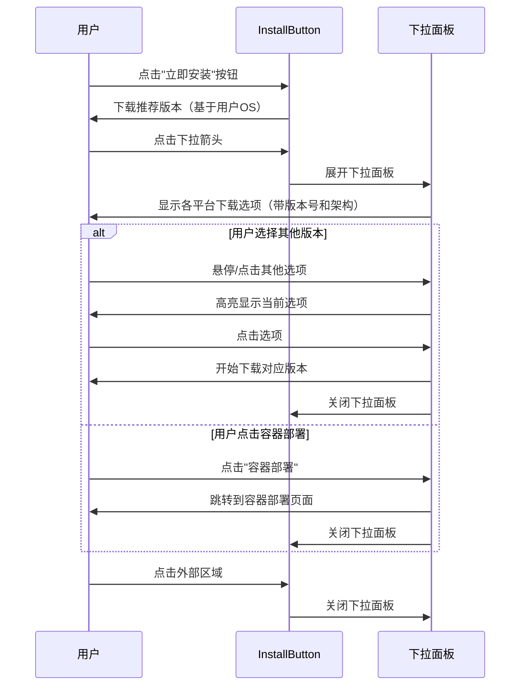
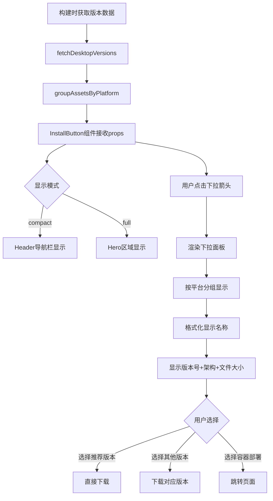
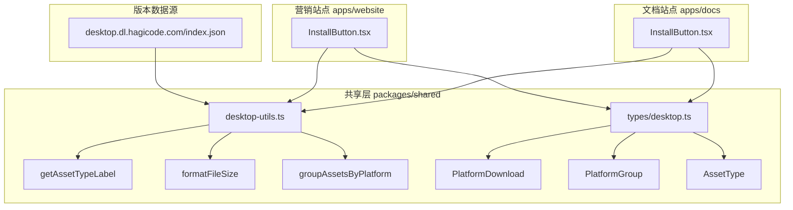

# Change: 优化 InstallButton 组件版本显示

## Why

当前 InstallButton 组件的下拉面板存在以下问题：
1. **操作系统版本区分不明确**：同一操作系统的不同版本或架构（如 macOS 的 Intel vs Apple Silicon）缺乏视觉上的明显区分
2. **显示名称信息不足**：未显示版本号，缺少架构标识（如 x64、ARM64），重复性展示问题导致用户难以识别
3. **下拉面板尺寸过小**：限制了信息的完整展示，影响用户体验

这些问题导致用户难以快速准确地找到适合自己的版本，增加了下载错误的风险。

## What Changes

### 核心变更

- **增强操作系统版本区分**：为每个操作系统添加视觉分隔或分组标题，使用图标、颜色或排版区分不同操作系统类型
- **优化显示名称格式**：重构显示名称，包含版本号、架构标识和发行版信息
- **扩大下拉面板尺寸**：增加面板的宽度和高度，优化内边距和行间距
- **同步更新两个站点**：确保文档站点和营销站点的 InstallButton 组件实现保持一致

### 技术实现要点

- 更新共享的 `Desktop` 类型定义（`packages/shared/src/types/desktop.ts`），确保包含版本、架构等完整信息
- 修改下拉面板的渲染逻辑，实现分组和格式化显示
- 调整组件样式，扩大面板尺寸并优化视觉层次
- 更新 `getAssetTypeLabel` 函数以支持更详细的显示格式

## UI 设计变更

### 当前 UI 问题

```
┌─────────────────────────────────────┐
│ macOS                               │
│   Apple Silicon          102 MB     │
│   Intel 版               98 MB      │
│                                     │
│ Windows                             │
│   安装程序               107 MB     │
│   便携版                 105 MB     │
│                                     │
│ Linux                               │
│   AppImage               95 MB      │
│   Debian 包              92 MB      │
│                                     │
│ ──────────────────────────────────  │
│   🐳 容器部署           →          │
└─────────────────────────────────────┘
```

**问题**：
- 未显示版本号（如 v0.1.12）
- 架构信息不够明确（如未标注 ARM64、x64）
- macOS 两个选项显示名称过于相似
- 面板宽度较窄，信息展示受限

### 优化后的 UI 设计

```
┌─────────────────────────────────────────────────────────────────┐
│ 🍎 macOS                                                 v0.1.12│
│   Apple Silicon (ARM64)                          102 MB    ⭐推荐│
│   Intel (x64)                                      98 MB        │
│                                                                 │
│ 🪟 Windows                                               v0.1.12│
│   安装程序 (x64) Setup                          107 MB    ⭐推荐│
│   便携版 (x64) Portable                           105 MB        │
│   Microsoft Store                                                │
│                                                                 │
│ 🐧 Linux                                                 v0.1.12│
│   AppImage (通用)                                 95 MB     ⭐推荐│
│   Debian 包 (Ubuntu/Debian)                      92 MB         │
│   压缩包 (Tarball)                                89 MB         │
│                                                                 │
│ ────────────────────────────────────────────────────────────── │
│   🐳 容器部署                                           →      │
└─────────────────────────────────────────────────────────────────┘
```

**改进点**：
- ✅ 显示完整版本号（v0.1.12）
- ✅ 明确标注架构类型（ARM64、x64）
- ✅ 使用图标增强平台识别（🍎🪟🐧）
- ✅ 添加推荐标识（⭐推荐）
- ✅ 扩大面板宽度，信息展示更舒适
- ✅ 增加视觉分组和分隔

### 下拉面板尺寸对比

| 项目 | 当前值 | 优化值 | 变更说明 |
|------|--------|--------|----------|
| 面板宽度 | 280px | 380px | 增加 100px 以容纳更多信息 |
| 面板最大高度 | 400px | 500px | 增加以减少滚动 |
| 行高 | 32px | 40px | 增加 8px 提升可读性 |
| 内边距 | 8px | 12px | 增加 4px 提升视觉舒适度 |
| 字体大小 | 14px | 14px | 保持不变 |

### 交互流程



## 代码流程变更

### 数据流图



### 组件交互图



### 代码变更清单

| 文件路径 | 变更类型 | 变更原因 | 影响范围 |
|---------|---------|---------|---------|
| `packages/shared/src/types/desktop.ts` | 修改 | 添加版本号字段到 PlatformDownload 接口 | 数据结构 |
| `packages/shared/src/desktop-utils.ts` | 修改 | 更新 getAssetTypeLabel 函数以支持详细显示格式 | 工具函数 |
| `apps/docs/src/components/InstallButton.tsx` | 修改 | 更新下拉面板渲染逻辑，添加版本号和架构显示 | 文档站点组件 |
| `apps/website/src/components/home/InstallButton.tsx` | 修改 | 更新下拉面板渲染逻辑，添加版本号和架构显示 | 营销站点组件 |
| `apps/website/src/components/home/InstallButton.module.css` | 修改 | 调整下拉面板尺寸样式 | 营销站点样式 |
| `apps/docs/src/styles/install-button.css` | 修改 | 调整下拉面板尺寸样式 | 文档站点样式 |

#### 详细变更 - desktop-utils.ts

| 函数名 | 变更类型 | 具体变更 | 变更原因 |
|-------|---------|---------|---------|
| getAssetTypeLabel | 修改 | 增加版本号和架构信息的格式化 | 支持更详细的显示名称 |
| formatAssetLabel | 新增 | 格式化完整的下载选项标签（包含版本、架构、大小） | 提供统一的标签格式化 |

#### 详细变更 - InstallButton.tsx (两个站点)

| 属性/方法 | 变更类型 | 变更前 | 变更后 | 变更原因 |
|----------|-------|-------|-------|---------|
| PlatformDownload.label | 使用 | 仅为文件名 | 格式化标签（版本+架构） | 显示更友好的信息 |
| 下拉面板宽度 | CSS | 280px | 380px | 容纳更多信息 |
| 平台分组标题 | 内容 | 仅平台名称 | 平台名称+图标+版本号 | 增强识别性 |

## Impact

### 受影响的组件

- **文档站点 InstallButton** (`apps/docs/src/components/InstallButton.tsx`)
  - Header 导航栏中的安装按钮
  - 使用内联样式（需要创建对应的 CSS 文件或更新现有样式）

- **营销站点 InstallButton** (`apps/website/src/components/home/InstallButton.tsx`)
  - Hero 区域的主要下载入口
  - Header 中的紧凑模式按钮
  - 使用 CSS 模块（InstallButton.module.css）

### 不受影响的部分

- ✅ 版本数据获取逻辑（fetchDesktopVersions）
- ✅ 平台检测逻辑（detectOS）
- ✅ 文件大小格式化（formatFileSize）
- ✅ 资源类型推断（inferAssetType）
- ✅ Version Manager 工作流
- ✅ Deploy 工作流

### 数据兼容性

- **向后兼容**：新实现保持与现有数据结构的兼容性
- **API 兼容**：不需要修改 `desktop.dl.hagicode.com/index.json` 的数据格式
- **组件接口**：保持现有的 props 接口，仅增强显示内容

### 用户体验改进

| 方面 | 当前状态 | 优化后 | 改进程度 |
|------|---------|--------|----------|
| 版本识别 | 需要点击或查看文件名 | 直接在下拉面板显示 | ⬆️ 大幅提升 |
| 架构识别 | 模糊（Apple Silicon vs Intel） | 明确标注（ARM64 vs x64） | ⬆️ 大幅提升 |
| 视觉舒适度 | 面板较小，信息紧凑 | 面板宽敞，层次清晰 | ⬆️ 中等提升 |
| 操作准确性 | 容易下载错误版本 | 推荐标识明确 | ⬆️ 中等提升 |

### 风险评估

| 风险 | 影响 | 缓解措施 |
|------|------|---------|
| 样式冲突 | 中等 | 使用 CSS 模块和特定类名避免冲突 |
| 响应式适配 | 低 | 测试不同屏幕尺寸，添加响应式断点 |
| 版本号获取失败 | 低 | 已有降级机制，显示"版本未知" |
| 性能影响 | 极低 | 仅涉及文本渲染，无额外计算 |

### 成功标准

1. ✅ 下拉面板显示完整的版本号（v0.1.12）
2. ✅ 每个下载选项明确标注架构类型（ARM64、x64）
3. ✅ 面板宽度增加至 380px，高度最大 500px
4. ✅ 使用图标增强平台识别（🍎🪟🐧）
5. ✅ 推荐版本有明确的视觉标识（⭐推荐）
6. ✅ 两个站点的实现保持一致
7. ✅ 响应式设计在移动端正常显示
8. ✅ 无 TypeScript 类型错误
9. ✅ 构建成功，无警告
