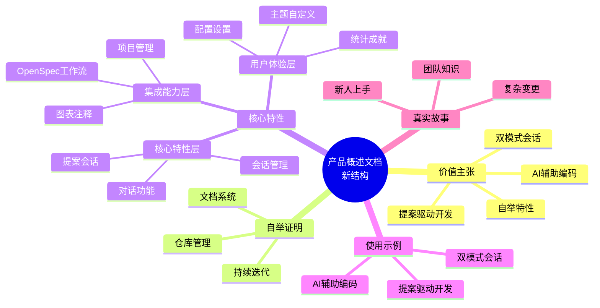

# Change: 优化产品概述文档

## Why

当前产品概述文档 (`apps/docs/src/content/docs/product-overview.md`) 存在以下问题:

1. **价值主张不明确** - 未清晰传达用户选择 Hagicode 的核心理由,缺乏强有力的说服力
2. **特性展示不突出** - 核心功能特性缺乏结构化呈现和视觉层次
3. **可信度缺失** - 未充分利用"工具本身使用工具开发"这一独特自举特性
4. **实例缺乏** - 缺少具体使用场景和代码示例来说明工具的实际效用

这些问题可能导致:
- 潜在用户无法快速理解产品独特价值
- 降低文档转化率和用户留存
- 削弱 Hagicode 相对于竞品的差异化优势

## What Changes

### 内容结构优化

- **添加价值主张章节** - 在文档开头明确阐述 Hagicode 的核心价值主张
- **重构特性展示** - 按优先级分层组织核心特性(核心特性层、集成能力层、用户体验层)
- **新增自举证明部分** - 展示 Hagicode 文档站点和仓库管理如何使用该工具开发
- **添加使用示例** - 为每个核心特性添加具体的代码示例和使用场景

### 具体变更

1. **新增章节**:
   - "为什么选择 Hagicode?" (价值主张)
   - "自举证明" (工具开发工具)
   - "核心特性详解" (结构化特性展示)
   - "使用示例" (代码和场景示例)

2. **优化现有章节**:
   - 重写 "Hagicode 是什么?" 部分,更清晰地描述产品定位
   - 增强 "真实使用故事" 部分,添加更多量化指标
   - 改进 "核心功能一览" 的视觉呈现

3. **删除冗余内容**:
   - 移除重复的功能描述
   - 精简过于技术化的术语

## UI Design Changes

### 产品概述文档新结构

```
产品概述文档结构
├── 1. 价值主张(新增)
│   ├── 核心价值点
│   │   ├── 提案驱动开发
│   │   ├── 双模式会话
│   │   ├── AI 辅助编码
│   │   └── 自举特性
│   └── 目标用户画像
│
├── 2. 产品定位(优化)
│   ├── Hagicode 是什么?
│   ├── 与竞品的差异化
│   └── 适用场景
│
├── 3. 自举证明(新增)
│   ├── 文档系统自举
│   ├── 仓库管理自举
│   └── 持续迭代自举
│
├── 4. 核心特性详解(重构)
│   ├── 核心特性层
│   │   ├── 会话管理
│   │   ├── 对话功能
│   │   └── 提案会话
│   ├── 集成能力层
│   │   ├── OpenSpec 工作流
│   │   ├── 图表和注释
│   │   └── 项目管理
│   └── 用户体验层
│       ├── 配置和设置
│       ├── 主题自定义
│       └── 统计成就
│
├── 5. 使用示例(新增)
│   ├── 提案驱动开发示例
│   ├── 双模式会话示例
│   └── AI 辅助编码示例
│
├── 6. 真实使用故事(增强)
│   ├── 故事 1: 新人上手
│   ├── 故事 2: 复杂变更
│   └── 故事 3: 团队知识
│
└── 7. 快速开始导航(保持)
```

### Mermaid 思维导图 - 新文档结构



## Impact

### 受影响的文档
- `apps/docs/src/content/docs/product-overview.md` - 主要修改目标

### 受影响的规范
- `content-documentation` - 新增产品概述文档内容要求

### 预期效果

1. **提升转化率** - 清晰的价值主张帮助潜在用户快速理解工具优势
2. **增强可信度** - 自举特性证明工具的实用性和成熟度
3. **降低学习门槛** - 结构化展示和具体示例加速用户上手
4. **强化品牌定位** - 突出提案驱动开发的独特卖点
5. **改善文档可维护性** - 与 OpenSpec project.md 标准对齐,便于后续更新

### 风险评估

- **低风险** - 仅文档内容变更,不影响代码功能
- **兼容性** - 变更后保持与现有导航结构的兼容性
- **链接完整性** - 需要确保内部链接在新结构下仍然有效

### 验证标准

- 文档构建成功 (`npm run build:docs`)
- 所有内部链接有效
- 内容在浅色和深色主题下都清晰可读
- 移动端响应式布局正常
- 内容符合项目文档规范
