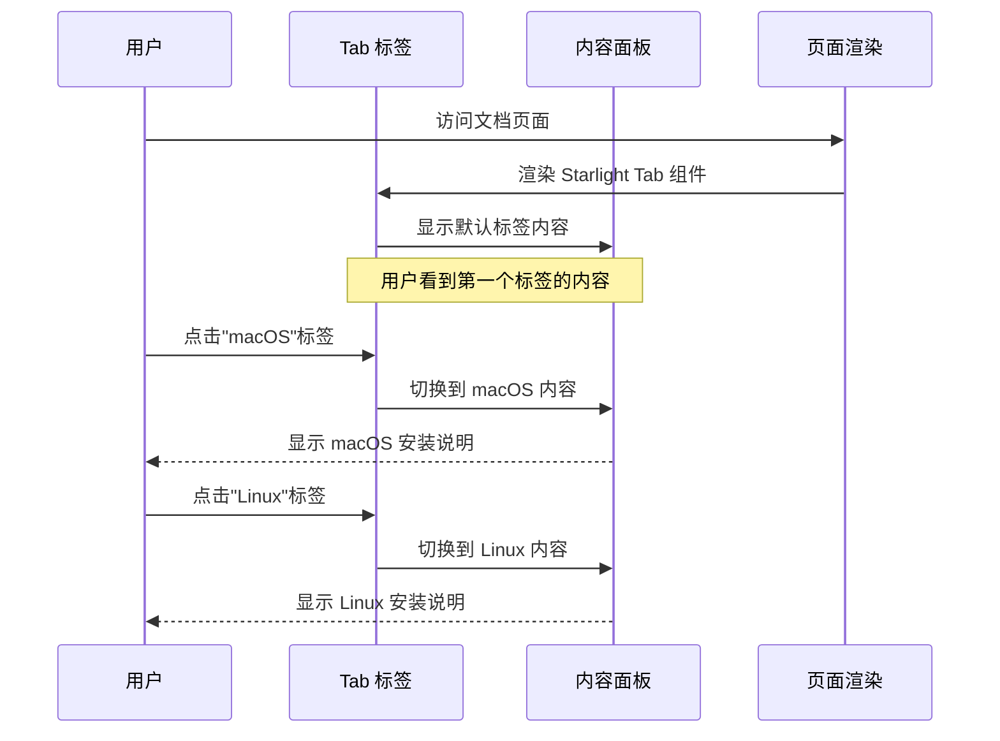
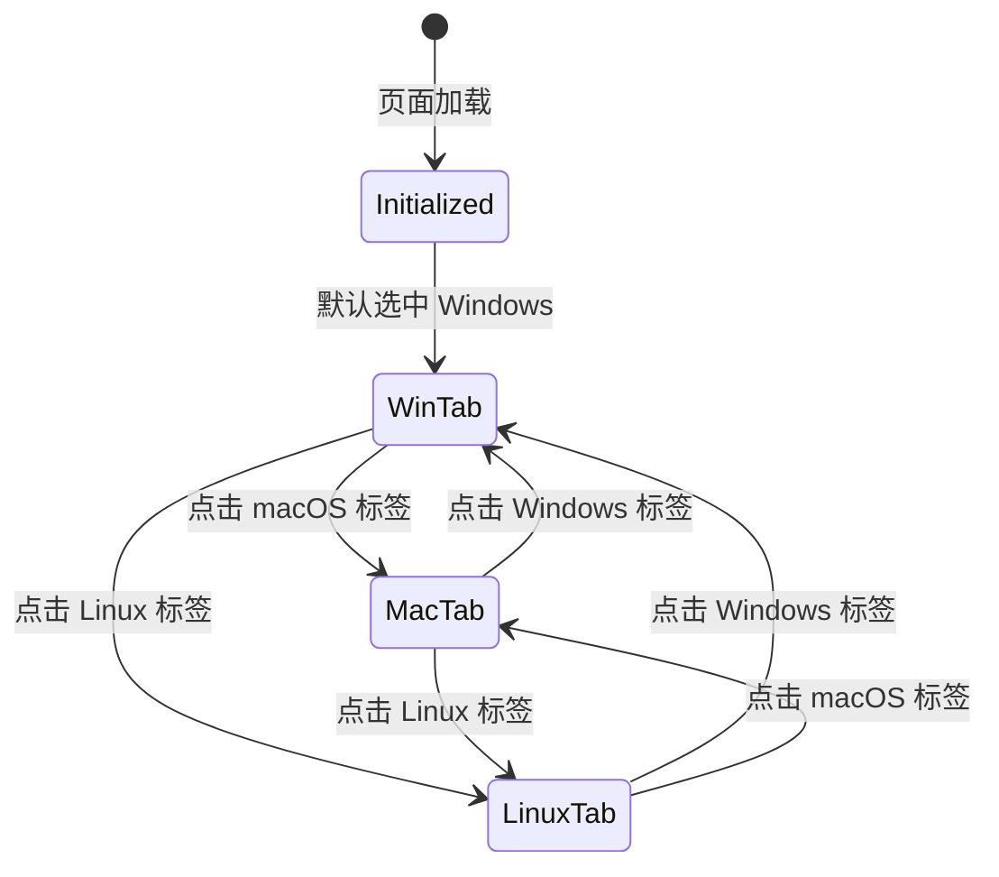

# Change: 修复 Starlight Tab 组件在 MDX 中的渲染问题

## Why

当前 Hagicode 文档站点（apps/docs）中，部分 MDX 文档使用 Starlight 内置的 Tab 组件（从 `@astrojs/starlight/components` 导入）时存在渲染异常。虽然组件导入语法正确，但在某些情况下可能无法正确显示标签切换功能，影响用户阅读体验和文档可用性。需要验证并确保 Starlight Tab 组件在 MDX 环境中的正常工作。

## What Changes

**问题诊断**：
- Starlight 0.37.4 版本原生支持 Tab 组件，无需额外配置
- 组件应通过 `import { Tabs, TabItem } from '@astrojs/starlight/components'` 导入
- 问题可能涉及：MDX 集成配置、Content Collections 配置、或组件使用方式

**核心变更**：
1. **验证 MDX 集成配置** - 确保 `@astrojs/mdx` 插件正确配置并与 Starlight 兼容
2. **检查 Content Collections 设置** - 验证 `src/content.config.ts` 中的 docs collection 配置允许在 MDX 中使用 Starlight 组件
3. **测试 Tab 组件语法** - 确认使用的组件语法符合 Starlight 文档规范
4. **验证构建配置** - 检查 `astro.config.mjs` 中的插件顺序和配置

**不涉及**：
- 不修改 Starlight 主题的核心代码
- 不引入新的第三方依赖
- 不改变文档的 frontmatter 结构

## UI Design Changes

### 当前状态（可能的问题表现）

```
┌─────────────────────────────────────┐
│ 安装 OpenSpec                        │
├─────────────────────────────────────┤
│ [Tab 组件可能未正确渲染]              │
│                                      │
│ - 标签按钮缺失或样式异常              │
│ - 点击切换无响应                      │
│ - 所有内容堆叠显示                    │
└─────────────────────────────────────┘
```

### 目标状态（修复后）

```
┌─────────────────────────────────────┐
│ 安装 OpenSpec                        │
├─────────────────────────────────────┤
│ ┌─────┬──────┬──────┐               │
│ │Win  │ macOS │ Linux│  ← 可点击标签  │
│ └─────┴──────┴──────┘               │
│ ┌─────────────────────────────────┐ │
│ │ Windows 安装内容...              │ │
│ └─────────────────────────────────┘ │
│                                      │
│ ✓ 点击标签切换内容                    │
│ ✓ 键盘导航支持                        │
│ ✓ 暗色主题兼容                        │
└─────────────────────────────────────┘
```

### 用户交互流程



### 组件状态转换



## Impact

**影响的规范**：
- `specs/astro-site/spec.md` - 添加或修改关于 Starlight Tab 组件在 MDX 中使用的要求

**影响的代码**：
- `apps/docs/astro.config.mjs` - 可能需要调整插件配置顺序
- `apps/docs/src/content.config.ts` - 可能需要更新 Content Collections schema
- `apps/docs/src/content/docs/**/*.mdx` - 使用 Tab 组件的文档文件

**不影响**：
- Starlight 主题文件
- 现有的 frontmatter 验证规则
- 其他 Starlight 组件的使用
- Marketing site (apps/website)

**兼容性保证**：
- 兼容现有暗色主题
- 保持移动端响应式布局
- 维持键盘导航和无障碍功能
- 无需添加新的依赖包

**验证标准**：
- [ ] Starlight Tab 组件在 MDX 中正确渲染
- [ ] 标签切换功能正常工作
- [ ] 键盘导航支持（Tab/Arrow keys）
- [ ] 暗色模式下样式正确
- [ ] 移动端响应式表现良好
- [ ] 通过 `npm run build:docs` 构建无错误
- [ ] 通过 `npm run typecheck` 类型检查无错误
- [ ] 本地开发服务器 `npm run dev:docs` 正常运行

## 技术验证点

1. **Starlight 版本兼容性**：@astrojs/starlight 0.37.4 原生支持 Tab 组件
2. **MDX 集成**：@astrojs/mdx 4.3 与 Starlight 组件系统的兼容性
3. **Content Collections**：docsLoader 和 extensions 配置正确性
4. **插件配置顺序**：rehype 插件与 Starlight 的交互
