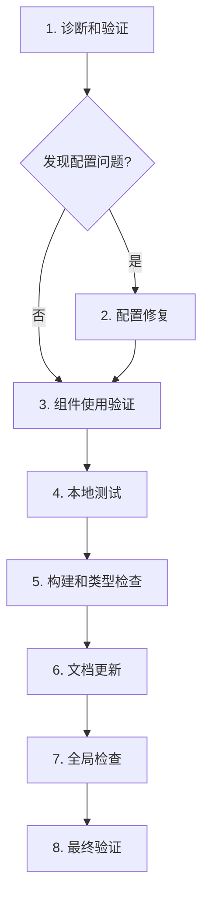
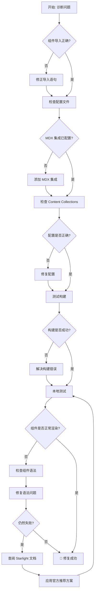

# 修复 Starlight Tab 组件 MDX 渲染问题 - 实施任务

## 1. 诊断和验证（必须最先完成）

- [ ] 1.1 验证 Starlight Tab 组件导入方式
  - 检查现有 MDX 文件中的导入语句
  - 确认使用 `import { Tabs, TabItem } from '@astrojs/starlight/components'`
  - 记录所有使用 Tab 组件的文档路径

- [ ] 1.2 检查当前配置文件
  - 验证 `apps/docs/astro.config.mjs` 中的 MDX 集成配置
  - 检查 Starlight 插件配置是否正确
  - 确认 rehype 插件顺序不会干扰组件渲染

- [ ] 1.3 验证 Content Collections 配置
  - 检查 `apps/docs/src/content.config.ts` 中的 docs collection 配置
  - 确认 `extensions: ['.md', '.mdx']` 包含 .mdx 文件
  - 验证 schema 允许组件使用

- [ ] 1.4 测试当前构建状态
  - 运行 `npm run build:docs` 检查是否有构建错误
  - 运行 `npm run typecheck` 检查类型错误
  - 记录所有与 Tab 组件相关的警告或错误

## 2. 配置修复（如诊断发现配置问题）

- [ ] 2.1 修复 astro.config.mjs（如需要）
  - 确保 `mdx()` 集成在 integrations 数组中
  - 验证插件顺序：Starlight 应在 MDX 之后
  - 检查是否有冲突的 rehype 插件配置

- [ ] 2.2 更新 content.config.ts（如需要）
  - 确保 docsLoader 支持 .mdx 扩展名
  - 验证 schema 配置不会阻止组件使用
  - 检查是否需要更新 Starlight schema 版本

- [ ] 2.3 验证依赖版本
  - 运行 `npm list @astrojs/starlight @astrojs/mdx` 检查版本
  - 确认版本兼容性（Starlight 0.37.4 + MDX 4.3）
  - 如需要，更新依赖到兼容版本

## 3. 组件使用方式验证

- [ ] 3.1 检查现有 Tab 组件使用
  - 打开所有使用 Tab 组件的 MDX 文件
  - 验证组件语法是否符合 Starlight 文档
  - 检查是否有未闭合的标签或属性错误

- [ ] 3.2 创建测试文档
  - 在 `apps/docs/src/content/docs/` 下创建测试文件
  - 使用标准 Starlight Tab 组件语法
  - 包含多个标签和不同类型的内容

- [ ] 3.3 验证组件属性
  - 测试 `value` 属性（标签唯一标识符）
  - 测试 `label` 属性（显示文本）
  - 验证嵌套内容是否正确渲染

## 4. 本地测试和验证

- [ ] 4.1 启动开发服务器
  - 运行 `npm run dev:docs`
  - 导航到包含 Tab 组件的页面
  - 检查组件是否正确渲染

- [ ] 4.2 测试交互功能
  - 点击每个标签，验证内容切换
  - 测试键盘导航（Tab 键、方向键）
  - 验证默认选中的标签显示正确

- [ ] 4.3 测试主题兼容性
  - 切换到暗色主题
  - 验证 Tab 组件样式正确
  - 检查颜色对比度是否足够

- [ ] 4.4 测试响应式布局
  - 在移动视口下测试（375px 宽度）
  - 验证标签在小屏幕上的布局
  - 测试触摸交互是否流畅

## 5. 构建和类型检查

- [ ] 5.1 运行生产构建
  - 执行 `npm run build:docs`
  - 检查构建输出是否有错误或警告
  - 验证生成的 HTML 包含正确的 Tab 组件结构

- [ ] 5.2 运行类型检查
  - 执行 `npm run typecheck`
  - 修复所有 TypeScript 类型错误
  - 确保组件导入路径正确解析

- [ ] 5.3 预览生产构建
  - 运行 `npm run preview:docs`
  - 在预览环境中测试 Tab 组件
  - 验证静态构建版本的功能

## 6. 文档更新和示例

- [ ] 6.1 创建使用示例（如需要）
  - 在适当位置添加 Tab 组件使用示例
  - 记录正确的导入语法
  - 说明常见问题和解决方案

- [ ] 6.2 更新项目文档（如需要）
  - 在 `openspec/project.md` 中记录 Tab 组件使用约定
  - 添加到 MDX 编写最佳实践
  - 更新组件使用指南

## 7. 全局检查和修复

- [ ] 7.1 搜索所有 Tab 组件使用
  - 运行 `grep -r "from '@astrojs/starlight/components'" apps/docs/src/content/docs/`
  - 列出所有使用 Starlight 组件的文件
  - 逐个验证每个文件的组件使用

- [ ] 7.2 批量修复问题（如发现）
  - 对需要修复的文件进行批量更新
  - 确保所有文件使用一致的导入语法
  - 验证所有修改后的文件

## 8. 最终验证

- [ ] 8.1 完整回归测试
  - 测试所有包含 Tab 组件的页面
  - 验证标签切换、键盘导航、主题兼容性
  - 检查移动端和桌面端的表现

- [ ] 8.2 代码审查
  - 使用 `git diff` 检查所有变更
  - 确认没有意外的修改
  - 验证代码一致性和最佳实践

- [ ] 8.3 准备提交
  - 整理所有变更
  - 编写清晰的提交消息
  - 更新 tasks.md 中的复选框状态

## 验收标准

完成所有任务后，以下标准必须满足：

- [ ] 所有 Starlight Tab 组件在 MDX 文档中正确渲染
- [ ] 标签切换功能正常，无闪烁或延迟
- [ ] 键盘导航完全可用（Tab、Arrow keys、Home、End）
- [ ] 暗色模式下样式正确，颜色对比度足够
- [ ] 移动端响应式布局良好，触摸交互流畅
- [ ] `npm run build:docs` 构建无错误和警告
- [ ] `npm run typecheck` 类型检查无错误
- [ ] 所有使用 Tab 组件的文档页面经过验证

## 估计时间

- **总计**: 约 2-4 小时
  - 诊断和验证: 30-45 分钟
  - 配置修复（如需要）: 30-60 分钟
  - 组件验证和测试: 45-90 分钟
  - 文档更新和全局检查: 30-60 分钟

## 依赖关系

- 任务 1 必须最先完成（诊断问题）
- 任务 2 依赖任务 1 的结果（仅在发现配置问题时执行）
- 任务 3、4、5 必须顺序执行
- 任务 6、7 可以并行执行
- 任务 8 必须在所有其他任务完成后执行

## 决策树

