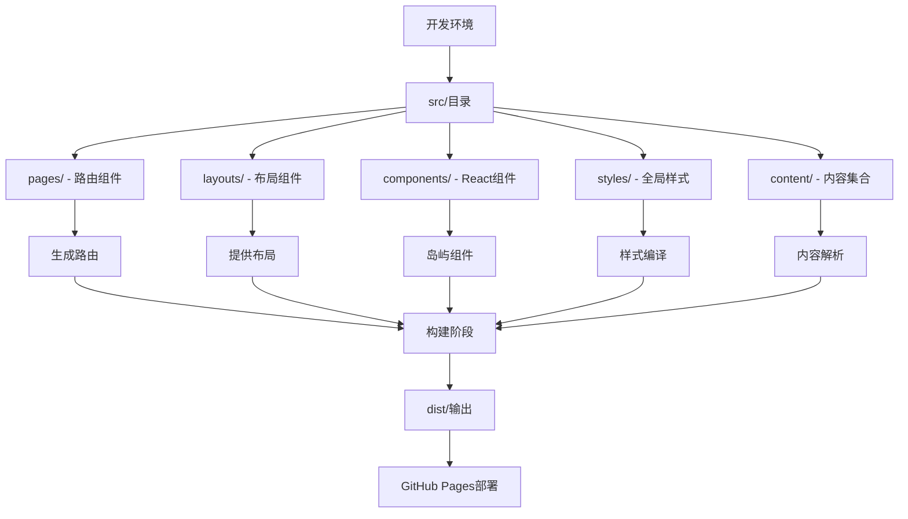
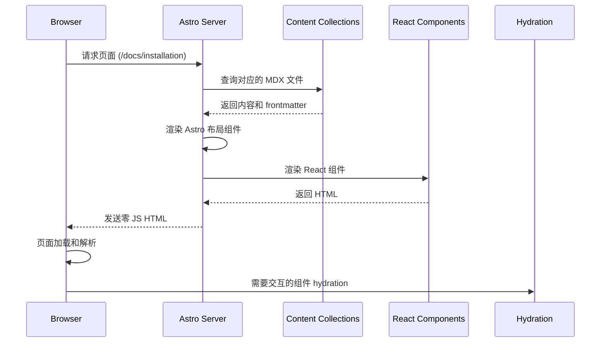
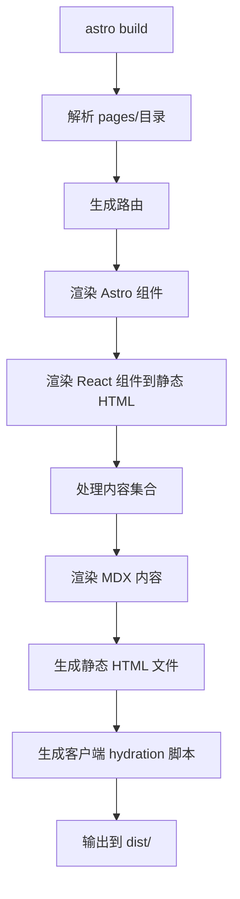

## Context

当前项目是一个使用 Docusaurus 3.x 构建的单语言 (简体中文) 文档网站,托管在 GitHub Pages 上。为了解决 SEO 性能、构建速度和资源体积问题,我们计划迁移到 Astro 4.x+。

### 核心约束条件
- 必须支持现有功能(Markdown/MDX、TypeScript、React 组件、Mermaid 图表)
- 必须保持单语言 (简体中文) 支持
- 必须保持 GitHub Pages 部署流程不变
- 必须保持 OpenSpec 规范驱动开发流程

## Goals / Non-Goals

### Goals
1. 实现零 JS HTML 输出,提升 SEO 和页面加载性能
2. 实现更快的构建速度和更小的资源体积
3. 保持与现有内容结构和 URL 路由的兼容性
4. 保留所有自定义 React 组件和样式
5. 简化项目结构,降低维护成本

### Non-Goals
1. 不添加多语言支持
2. 不引入新的文档内容
3. 不重写所有组件(保留 React 集成)
4. 不改变视觉设计(保持现有样式)

## Decisions

### 1. 框架选择: Astro 4.x+
**决定**: 采用 Astro 4.x+ 作为新的静态站点生成器

**原因**:
- 默认零 JS 输出,对 SEO 和性能极其友好
- 岛屿架构 (Islands Architecture) 实现按需 hydration
- 支持 React 组件集成 (符合现有技术栈)
- 构建速度显著快于 Docusaurus
- 社区活跃,生态系统不断增长

**备选方案**:
- **Next.js 静态生成**: 更复杂,需要额外配置路由系统
- **VitePress**: Vue 生态,与现有 React 组件不兼容
- **Gatsby**: 过于复杂,不适合简单文档站点
- **Eleventy**: 更轻量但生态不如 Astro 活跃

### 2. 组件架构: React 集成 + Astro 组件
**决定**: 保留现有 React 组件,使用 `@astrojs/react` 集成

**原因**:
- 最小化重构成本
- 保留现有组件功能和交互
- Astro 对 React 支持良好
- 可以逐步迁移到 Astro 组件

**架构**:
```
项目结构
├── src/
│   ├── components/    # 现有 React 组件
│   ├── layouts/       # Astro 布局组件
│   ├── pages/         # Astro 页面组件 (路由)
│   └── styles/        # 全局和组件样式
```

### 3. 路由系统: Astro 文件系统路由
**决定**: 使用 Astro 的文件系统路由替代 Docusaurus 的配置式路由

**原因**:
- 更直观,基于文件结构自动生成路由
- 支持动态路由 (`[...slug].astro`) 处理文档页面
- 无需额外配置 (如 `sidebars.ts`)

**文档路由示例**:
```
src/pages/
├── index.astro              # 首页
├── docs/[...slug].astro    # 动态路由处理所有文档页面
└── blog/[...slug].astro    # 动态路由处理博客文章
```

### 4. 内容管理: Astro 集合 (Collections)
**决定**: 使用 Astro 集合管理 `docs/` 和 `blog/` 内容

**原因**:
- 内置内容集合支持,无需额外插件
- 类型安全的 frontmatter 验证
- 支持内容查询和过滤
- 可以继承 `_category_.json` 的分类结构

**集合配置示例** (`src/content/config.ts`):
```typescript
import { defineCollection, z } from 'astro:content';

const docs = defineCollection({
  type: 'content',
  schema: z.object({
    title: z.string(),
    description: z.string(),
    publishDate: z.date().optional(),
  }),
});

const blog = defineCollection({
  type: 'content',
  schema: z.object({
    title: z.string(),
    description: z.string(),
    publishDate: z.date(),
    author: z.string().optional(),
  }),
});

export const collections = {
  docs,
  blog,
};
```

### 5. 样式方案: 保留 CSS 变量 + 全局样式
**决定**: 保留现有的 `custom.css` 样式,调整为 Astro 全局样式

**原因**:
- 保持视觉设计一致性
- 最小化重构工作量
- CSS 变量方式在 Astro 中工作正常
- 支持深色主题切换

**样式架构**:
```
src/
└── styles/
    ├── custom.css        # 迁移自 src/css/custom.css
    └── global.css        # Astro 全局样式入口
```

### 6. 图表支持: @astrojs/mermaid
**决定**: 使用 `@astrojs/mermaid` 替代 Docusaurus 主题集成

**原因**:
- 官方维护的 Astro 集成
- 支持 Mermaid 图表渲染
- 与 Astro 架构无缝集成

### 7. 分析集成: 脚本标签直接集成
**决定**: 使用 HTML 脚本标签直接集成 Microsoft Clarity

**原因**:
- 无需额外 Astro 插件
- 保持功能不变
- 简化依赖

### 8. 部署流程: GitHub Pages + GitHub Actions
**决定**: 保持 GitHub Pages 部署,更新构建脚本

**原因**:
- 部署流程成熟稳定
- 团队熟悉当前工作流
- 无需额外成本

**更新后的工作流**:
```
on: push to main
├─ Checkout
├─ Setup Node.js 20
├─ Install dependencies (npm ci)
├─ Build (astro build) → dist/
├─ Upload artifact
└─ Deploy to gh-pages branch
```

## Technical Design

### 项目架构图



### 文件系统架构

```
hagicode-docs/
├── public/                    # 静态资源 (替代 static/)
│   ├── img/                  # 图片、favicon、logo
│   └── other/                # 其他资源
├── src/
│   ├── components/           # React组件 (迁移自 src/components/)
│   │   └── home/            # 首页组件
│   ├── content/              # Astro内容集合
│   │   ├── docs/             # 文档内容 (迁移自 docs/)
│   │   │   ├── installation/
│   │   │   ├── quick-start/
│   │   │   └── related-software-installation/
│   │   ├── blog/             # 博客内容 (迁移自 blog/)
│   │   └── config.ts        # 集合配置
│   ├── layouts/             # Astro布局组件
│   │   ├── Layout.astro     # 主布局
│   │   ├── DocsLayout.astro # 文档页面布局
│   │   └── BlogLayout.astro # 博客页面布局
│   ├── pages/               # Astro页面组件
│   │   ├── index.astro      # 首页
│   │   ├── docs/[...slug].astro # 文档路由
│   │   └── blog/[...slug].astro # 博客路由
│   └── styles/              # 全局样式
│       └── custom.css       # 迁移自 src/css/custom.css
├── astro.config.mjs         # Astro配置
├── tsconfig.json            # TypeScript配置
├── package.json             # 依赖配置
└── .github/workflows/
    └── deploy.yml           # GitHub Actions配置
```

### 数据流程

#### 内容渲染流程



#### 构建流程



## UI/UX Design

### 视觉一致性保证

**保持不变的视觉元素**:
- 主色调: `--ifm-color-primary: #2e8555`
- 深色主题支持
- Hero 区域样式 (3rem 标题、1.5rem 副标题、按钮居中)
- 响应式断点 (max-width: 996px)
- 代码块和 admonition 样式

**可能的优化**:
- 使用 Astro 的默认语义 HTML 结构
- 确保可访问性改进 (ARIA 属性)
- 优化图片加载 (srcset、loading="lazy")

### 导航栏组件

```ascii
┌─────────────────────────────────────────────────────────────────┐
│ Hagicode Docs                                                    │
│ ┌──────────┐  ┌──────────┐  ┌──────┐   ┌────────┐  ┌──────────┐ │
│ │ Docs     │  │ 博客     │  │ QQ群 │   │ 下载安装包 │  │ Docker Hub │ │
│ └──────────┘  └──────────┘  └──────┘   └────────┘  └──────────┘ │
└─────────────────────────────────────────────────────────────────┘
```

### 文档页面布局

```ascii
┌─────────────────────────────────────────────────────────────┐
│ 导航栏                                                       │
├──────────────────────┬───────────────────────────────────────┤
│                      │                                       │
│ 侧边栏导航           │ 文档内容                               │
│                      │                                       │
│ ┌───安装指南──────┐   │  # 安装指南                           │
│ │ - Docker         │  │  ...内容...                          │
│ │ - 二进制          │  │                                       │
│ └───Quick Start───┘  │  > 提示: 建议使用 Docker 安装          │
│                      │                                       │
│ └──相关软件安装───┘  │                                       │
│                      │                                       │
├──────────────────────┴───────────────────────────────────────┤
│ 页脚                                                       │
└─────────────────────────────────────────────────────────────┘
```

### 移动端导航

```ascii
┌──────────────────────────────────────────────────┐
│ ☰  Hagicode Docs                                 │
└──────────────────────────────────────────────────┘

[菜单展开后]
┌───────────────────────────┐
│ 导航菜单                   │
├───────────────────────────┤
│ Docs                      │
│ 博客                      │
│ QQ群                      │
│ 下载安装包                 │
│ Docker Hub                 │
└───────────────────────────┘
```

## Risks / Trade-offs

### 风险评估

| 风险 | 可能性 | 影响程度 | 缓解措施 |
|------|--------|----------|----------|
| React 组件 hydration 问题 | 中等 | 高 | 充分测试,使用 `client:visible` 或 `client:idle` |
| MDX 内容解析差异 | 低 | 中等 | 逐页验证,调整 frontmatter |
| 路由结构兼容性 | 低 | 高 | 保持 URL 结构一致,使用 Astro 重定向 |
| GitHub Pages 部署失败 | 低 | 高 | 测试工作流分支,准备回滚方案 |

### 架构 Trade-offs

#### 1. 岛屿架构 vs 全 Hydration
**选择**: 岛屿架构 (默认零 JS,按需 hydration)
**理由**:
- 提升 SEO 和首屏性能
- 减少客户端资源加载
- 支持渐进式增强

#### 2. 内容集合 vs 文件系统直接访问
**选择**: 内容集合
**理由**:
- 类型安全的 frontmatter 验证
- 内置查询功能
- 内容管理更结构化

#### 3. 保留 React 组件 vs 重写为 Astro 组件
**选择**: 保留 React 组件
**理由**:
- 最小化重构成本
- 保留现有功能和交互
- 可以在未来逐步迁移

## Migration Plan

### 阶段 1: 基础架构 (预计 1-2 天)
- Astro 项目初始化
- 依赖安装和配置
- TypeScript 和路径别名配置

### 阶段 2: 样式和布局 (预计 2-3 天)
- 迁移全局样式
- 实现导航栏和页脚
- 实现页面布局

### 阶段 3: 内容和路由 (预计 3-4 天)
- 配置内容集合
- 实现动态路由
- 迁移文档和博客内容

### 阶段 4: 组件和功能 (预计 3-4 天)
- 迁移 React 组件
- 配置图表和分析集成
- 测试交互功能

### 阶段 5: 测试和优化 (预计 2-3 天)
- 全面测试
- 性能优化
- 部署流程更新

### 阶段 6: 部署和验证 (预计 1 天)
- 合并到 main 分支
- 监控部署过程
- 验证生产站点

### 回滚计划
如果在任何阶段遇到无法解决的问题:
1. 恢复到备份分支
2. 重新部署 Docusaurus 版本
3. 分析失败原因,调整方案后重试

## Open Questions

### 1. MDX 组件导入方式是否需要调整?
**问题**: Astro MDX 导入组件方式与 Docusaurus 是否一致?
**答案**: 需要调整。Astro MDX 使用 `import` 语句而不是 Docusaurus 的 `@theme` 别名。

### 2. 文档版本控制如何处理?
**问题**: Astro 是否需要文档版本控制功能?
**答案**: 当前需求不需要,保持单版本文档。

### 3. 搜索功能如何实现?
**问题**: Docusaurus 内置搜索功能需要替代方案。
**答案**: 可以使用 Algolia 搜索或 Astro 社区搜索插件。

### 4. 代码语法高亮主题是否需要调整?
**问题**: Astro 的 Prism/Shiki 高亮主题与 Docusaurus 是否一致?
**答案**: 需要验证,可能需要调整配置。
