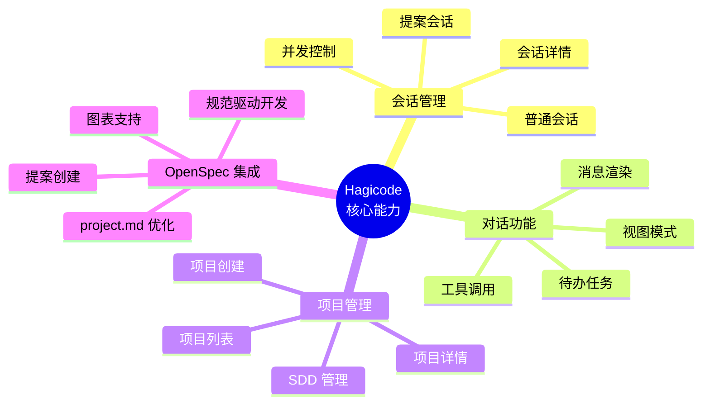

本概述文档将帮助您从产品定位、核心能力、技术架构和使用场景等多个维度,全面了解 Hagicode 这款 AI 驱动的代码开发辅助工具。

## 产品概述

### 什么是 Hagicode?

Hagicode 是一款创新的 AI 驱动代码开发辅助工具,旨在通过智能对话和提案驱动的工作流程,提升开发者的编码效率和代码质量。与传统的代码编辑器或简单的 AI 聊天工具不同,Hagicode 将 AI 深度集成到开发工作流中,提供从代码理解、分析到实现的全方位支持。

Hagicode 通过**两种会话模式**满足不同开发场景:

- **普通会话**: 类似 VS Code Copilot Chat 的聊天式交互,支持只读和编辑两种权限模式,提供灵活的 AI 辅助编码体验
- **提案会话**: 基于想法的结构化工作流,将抽象的想法转化为可执行的具体变更,包含规划、分解和执行阶段

### 核心价值主张

Hagicode 为开发者带来以下核心价值:

1. **智能代码理解** - AI 可以深入分析您的代码库,理解项目架构、设计模式和业务逻辑,提供精准的代码解释和建议

2. **安全可控的编辑权限** - 普通会话默认只读模式,确保 AI 只分析不修改;需要时切换到编辑模式,让 AI 执行具体变更

3. **提案驱动的开发流程** - 将想法转化为结构化的提案,通过 OpenSpec 工作流实现从构思到代码的规范驱动开发

4. **团队协作与知识管理** - 通过 SDD(软件设计文档)和 OpenSpec 集成,实现项目知识沉淀和团队协作

### 与传统开发工具的对比

| 特性 | 传统 IDE/编辑器 | AI 聊天工具 | Hagicode |
|------|---------------|-----------|----------|
| **代码理解** | 需要手动阅读代码 | 有限理解 | 深度分析整个代码库 |
| **AI 集成** | 插件形式,功能分散 | 仅聊天功能 | 深度集成工作流 |
| **权限控制** | 无 | 无 | 只读/编辑双模式 |
| **提案管理** | 无 | 无 | OpenSpec 规范驱动 |
| **知识管理** | 依赖外部工具 | 无 | 内置 SDD 系统 |
| **会话类型** | 单一模式 | 单一聊天模式 | 普通会话 + 提案会话 |

### 目标用户

Hagicode 适合以下用户群体:

- **开发者** - 提升 coding 效率,获得智能代码分析和实现建议
- **技术负责人** - 通过提案工作流管理复杂变更,确保代码质量和架构一致性
- **项目经理** - 了解项目进度,追踪功能实现,管理团队知识资产
- **开源维护者** - 高效处理 PR,自动化代码审查,管理项目规范

## 核心能力矩阵

Hagicode 的功能围绕四大核心能力模块构建,每个模块都针对开发工作流的关键环节设计:

### 会话管理

Hagicode 提供灵活的会话系统,支持不同的工作模式:

- **普通会话** - 与 AI 进行传统聊天式交互,支持代码分析、审查和修改
  - 只读模式: AI 可以读取、分析、描述代码,但无法进行修改
  - 编辑模式: AI 具备文件修改权限,可以实现功能、修复 bug、执行重构
- **提案会话** - 基于想法的结构化工作流,将抽象想法转化为具体执行计划
- **会话详情** - 查看会话历史、消息记录和执行结果
- **并发控制** - 管理多个同时进行的会话,避免资源冲突

### 对话功能

强大的对话功能让 AI 交互更加高效和智能:

- **消息渲染** - 支持 Markdown 代码块、语法高亮、表格和列表的富文本消息展示
- **工具调用** - AI 可以调用各种工具执行文件操作、运行命令、搜索代码等
- **待办任务** - AI 可以创建和管理任务清单,追踪实现进度
- **视图模式** - 支持不同的消息视图模式,适应不同屏幕和阅读偏好

### 项目管理

完整的项目生命周期管理能力:

- **项目列表** - 查看和管理所有项目,快速切换工作空间
- **项目详情** - 深入了解项目结构、SDD 状态和配置信息
- **项目创建** - 简单几步添加新项目,自动识别 Git 仓库
- **SDD 管理** - 初始化和管理软件设计文档,沉淀项目知识

### OpenSpec 集成

独特的规范驱动开发流程:

- **提案创建** - 将想法转化为结构化的提案文档,包含目标、范围、任务和验证标准
- **图表支持** - 使用 Mermaid 绘制架构图、流程图、状态图,可视化设计思路
- **规范驱动开发** - 遵循提案→实施→归档的规范流程,确保变更的可追溯性和质量
- **project.md 优化** - AI 自动分析和优化项目配置文件,添加领域上下文和提示词配置

## 使用场景

### 场景 1: AI 辅助代码开发(开发者视角)

**用户角色**: 软件工程师

**任务目标**: 快速理解新代码库并实现新功能

**使用流程**:

1. **创建项目** - 将新代码仓库添加到 Hagicode
2. **初始化 SDD** - 为项目建立软件设计文档结构
3. **普通会话探索**(只读模式) - 向 AI 询问项目架构、设计模式、业务逻辑
4. **规划实现** - 与 AI 讨论最佳实现方案
5. **切换到编辑模式** - 让 AI 实现具体功能
6. **代码审查** - 使用 AI 审查生成的代码,检查潜在问题

**价值产出**:

- 缩短新人上手时间,从几天缩短到几小时
- AI 帮助发现代码中的问题和改进机会
- 加速功能开发,提升代码质量

### 场景 2: 提案驱动的想法实现(技术负责人视角)

**用户角色**: 技术负责人/架构师

**任务目标**: 规范化地管理复杂变更,确保代码质量和架构一致性

**使用流程**:

1. **创建提案会话** - 描述想法或需求
2. **AI 生成提案** - OpenSpec 工作流自动生成结构化提案(proposal.md、tasks.md)
3. **审查和修改** - 技术负责人审查提案,调整范围和任务
4. **执行实施** - 按照任务清单逐步实施,使用 Mermaid 绘制架构图
5. **验证和归档** - 完成后验证标准,归档提案到 `changes/archive/`

**价值产出**:

- 规范化的变更管理流程,减少代码审查负担
- 完整的变更历史记录,支持代码审查和知识沉淀
- 确保架构一致性,避免技术债务累积

### 场景 3: 团队协作与知识管理(项目经理视角)

**用户角色**: 项目经理/团队负责人

**任务目标**: 了解项目进度,管理团队知识,追踪功能实现

**使用流程**:

1. **查看项目列表** - 了解所有项目的状态
2. **浏览 SDD 文档** - 查看项目的设计文档、提案和规范
3. **追踪提案进度** - 在 `openspec/changes/` 中查看进行中的提案
4. **使用统计功能** - 查看使用统计和效率评级
5. **配置通知** - 设置项目通知,及时了解重要变更

**价值产出**:

- 集中管理项目知识,减少信息孤岛
- 实时了解项目进度和团队工作状态
- 历史提案归档可作为新成员培训材料

## 快速导航

根据您的角色和需求,选择最适合的阅读路径:

### 新用户推荐路径

如果您是第一次接触 Hagicode,建议按以下顺序阅读:

1. **[本文档](/product-overview)** - 建立对产品的整体认知(您在这里)
2. **[安装指南](/installation/docker-compose/)** - 安装并运行 Hagicode
3. **[创建第一个项目](/quick-start/create-first-project)** - 初始化您的项目
4. **[创建普通会话](/quick-start/conversation-session)** - 开始与 AI 交互
5. **[创建提案会话](/quick-start/proposal-session)** - 了解提案工作流

## 后续步骤

现在您已经了解了 Hagicode 的产品全景,下一步可以:

---

**需要帮助?**

如果您在阅读本文档时有任何疑问,或发现需要改进的地方,欢迎:
- 在 GitHub 上提 Issue 报告问题或建议
- 查看其他快速入门文档获取更多细节
- 联系团队获取支持
